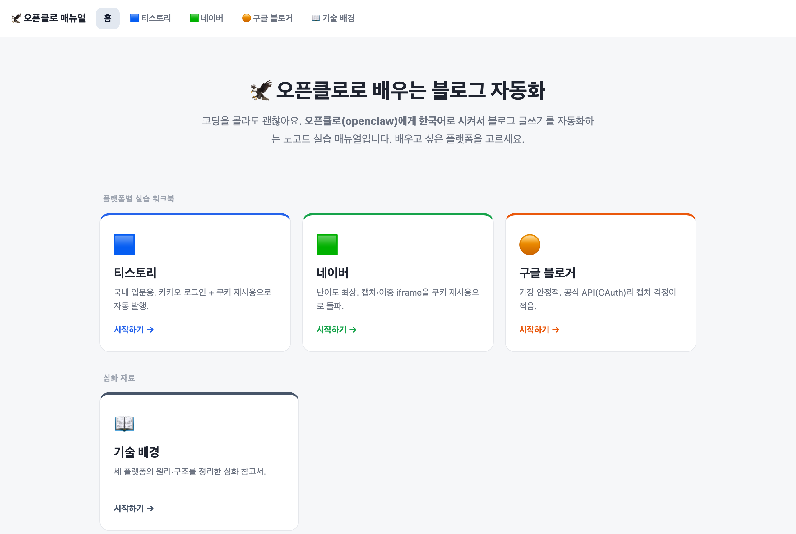
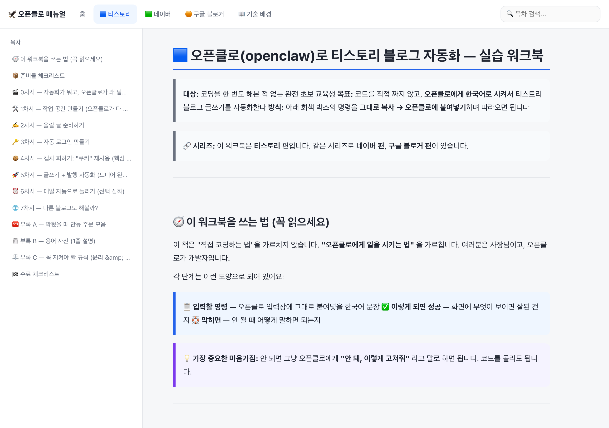

# 🦅 오픈클로(openclaw)로 배우는 블로그 자동화 매뉴얼

[](https://mintorain.github.io/openclaw-blog-automation/)
[](https://mintorain.github.io/openclaw-blog-automation/)
[](https://github.com/mintorain/openclaw-blog-automation/commits/main)
[](https://pandoc.org/)


코딩을 몰라도 괜찮습니다. **오픈클로(openclaw)에게 한국어로 시켜서** 티스토리·네이버·구글 블로거 글쓰기를 자동화하는 **노코드 교육용 매뉴얼**입니다.

### 🌐 라이브 사이트 → **https://mintorain.github.io/openclaw-blog-automation/**

---

## 📸 미리보기

| 홈 (플랫폼 선택) | 워크북 (티스토리 편) |
|:---:|:---:|
| [](https://mintorain.github.io/openclaw-blog-automation/) | [](https://mintorain.github.io/openclaw-blog-automation/tistory.html) |
| 플랫폼별 카드로 시작점 선택 | 사이드바 목차 · 검색 · 색상 콜아웃(`📋 명령`/`✅ 성공`/`🛟 막히면`) |

---

## 📚 무엇이 들어있나

완전 비전공·노코드 교육생을 위한 **플랫폼별 실습 워크북**입니다. 각 단계는 `📋 명령 → ✅ 성공 확인 → 🛟 막히면` 구조로, 회색 박스의 명령을 그대로 복사해 오픈클로에 붙여넣으며 따라하면 됩니다.

| 플랫폼 | 난이도 | 자동화 방식 | 특징 |
|--------|--------|-------------|------|
| 🟦 **티스토리** | ★★ | 셀레니움 + 쿠키 재사용 | 국내 블로그 입문용 |
| 🟩 **네이버** | ★★★ | 셀레니움 + 쿠키 재사용 | 캡차·이중 iframe 돌파 |
| 🟠 **구글 블로거** | ★ | 공식 API(OAuth) | 가장 안정적, 캡차 거의 없음 |

> 💡 처음이라면 가장 쉬운 **구글 블로거 편**부터 추천합니다.

---

## 🗂️ 저장소 구조

```
.
├── docs/                          # 📦 빌드된 웹사이트 (GitHub Pages가 서빙)
│   ├── index.html                 #   홈 (플랫폼 선택)
│   ├── tistory.html / naver.html / blogger.html / manual.html
│   ├── template.html              #   페이지 디자인 템플릿
│   └── build.py                   #   마크다운 → 사이트 빌드 스크립트
├── tistory/                       # 🛠️ 티스토리 Selenium 자동화 예시 코드 (강사용 정답)
│   ├── main.py · config.py · tistory_bot.py · cookie_store.py · ...
│   └── README.md
├── 교육-실습워크북-티스토리.md      # ✍️ 원본 워크북 (티스토리)
├── 교육-실습워크북-네이버.md        # ✍️ 원본 워크북 (네이버)
├── 교육-실습워크북-구글블로거.md    # ✍️ 원본 워크북 (구글 블로거)
└── 블로그-포스팅-자동화-매뉴얼.md   # 📖 기술 배경 매뉴얼 (심화)
```

---

## 🔧 사이트 수정 & 재배포

내용은 루트의 `교육-실습워크북-*.md` 원본 파일을 고친 뒤 다시 빌드합니다.

```bash
# 1) 원본 마크다운 수정
# 2) 사이트 재빌드 (pandoc 필요: brew install pandoc)
cd docs && python3 build.py

# 3) 커밋 & 푸시 → 1분 내 사이트 자동 반영
cd ..
git add -A && git commit -m "docs: 매뉴얼 수정" && git push
```

빌드 스크립트는 외부 CDN 없이 **자체 완결형 HTML**을 생성하므로, `docs/index.html`을 더블클릭하면 인터넷 없이 오프라인에서도 열립니다.

---

## ⚖️ 사용 시 주의

- 연습은 반드시 **비공개(초안) 글**로 시작하세요.
- **본인 계정으로, 소량만** 운영하세요. 과도한 자동화는 계정 정지·저품질 판정 사유입니다.
- 비밀번호·쿠키·인증 파일(`.env`, `cookies.json`, `client_secret*.json`)은 **절대 커밋·공유 금지** (`.gitignore`로 차단되어 있습니다).
- 자동화는 도구일 뿐이며, 운영 책임은 사용자 본인에게 있습니다.

---

## 🛠️ 기술 스택

- **콘텐츠**: Markdown
- **사이트 빌드**: Python + [pandoc](https://pandoc.org/) (Markdown → 정적 HTML)
- **배포**: GitHub Pages (`main` 브랜치 `/docs` 폴더)
- **예시 자동화 코드**: Python + Selenium

---

*openclaw 교육용 매뉴얼 · 노코드 교육생을 위한 블로그 자동화 실습 자료*
